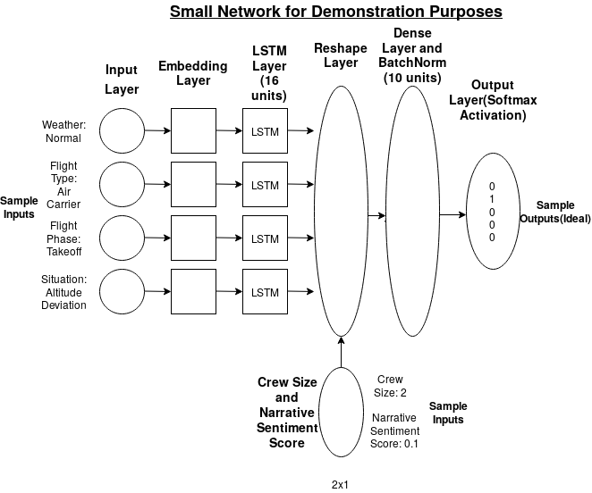

These files contain relevant code (minus data) to build a risk classifier for aviation incident safety, and the model itself.  

Each file serves the following purpose:  

**Front_end**  
Script contains a bit of data pre-processing based on the network, and specifies the hyper parameters of the network.  

**back_end**  
Contains modular functions called in the front end to build and train the network based on specified hyper parameters.

**data_wrangle**  
Pre-processing script: takes raw ASRS data and saves relevant data as input for the front end script  

**model.json**  
model in json string format  

**use_best**  
Post Processing script, takes the network and runs predictions, including printing the confusion matrix.  

**weights**
ZIP file containing the weights to go with the json string.

Architecture of the network formed by this code

